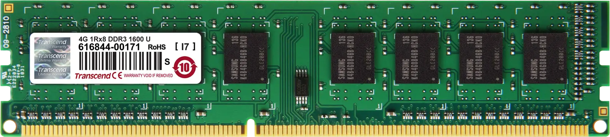

# C - La RAM

<p align="center">
    
</p>

La **RAM** (Random Access Memory) est une mémoire temporaire utilisée par l'ordinateur pendant qu'un programme tourne. Elle se vide quand on éteint l'ordinateur. C'est dans cette RAM que se trouvent plusieurs zones de mémoire importantes pour un programme, notamment :

1. La zone de code.
2. La zone des données statiques.
3. La Stack (pile).
4. La Heap (tas).

---

## La zone de code

Elle est l'endroit où sont stockées les instructions du programme (le code). Elle contient les instructions que l’ordinateur exécute pour faire fonctionner le programme.

- **Lecture seule** : la zone de code est généralement en lecture seule pour éviter qu’on ne modifie le programme par erreur pendant son exécution.
- **Usage** : elle contient les instructions que le processeur lit et exécute, ligne après ligne.

---

## La zone des données statiques

Elle est utilisée pour stocker les informations qui durent toute la vie du programme.

- **Variables globales** : les variables déclarées en dehors des fonctions, qui peuvent être utilisées partout dans le programme.
- **Variables statiques** : les variables locales marquées `static` qui gardent leur valeur entre les appels de la fonction.
- **Constantes** : les valeurs marquées `const` qui ne changent pas pendant l’exécution.

Ces données sont présentes dans la RAM dès le démarrage du programme et y restent jusqu’à la fin.

---

## La Stack (pile)

C'est une autre partie de la RAM, utilisée pour les données temporaires, comme les variables locales des fonctions. Elle fonctionne comme une pile d’assiettes en cuisine. À chaque fois qu’on entre dans la cuisine (appelle une fonction dans le programme), on pose une assiette pour se rappeler ce qu’on fait. Quand on a fini, on enlève l’assiette (la mémoire est libérée).

- **Fonctionnement** : à chaque fois qu'une fonction est appelée, une "frame" est ajoutée à la Stack, contenant les variables locales et l'adresse de retour. Quand la fonction se termine, la frame est retirée de la Stack.
- **Avantages** : rapide et automatique, car la mémoire est libérée automatiquement quand une fonction se termine et s'organise d'elle-même (dernier entré, premier sorti).
- **Limites** : la mémoire de la Stack est limitée. Si trop de mémoire est utilisée, on peut provoquer un `stack overflow`(dépassement de la pile).

---

## La Heap (tas)

C'est encore une autre zone de la RAM, utilisée pour les données qu'on veut garder plus longtemps, même après la fin d'une fonction. Elle fonctionne comme un grand tiroir dans lequel on range des objets à la main. On utilise `malloc` pour y mettre quelque chose et `free` pour le ranger.

- **Fonctionnement** : on utilise la heap pour allouer de la mémoire de manière dynamique, quand on veut garder les données disponibles plus longtemps. On doit libérer l’espace nous-mêmes en utilisant `free`. Si on oublie de le faire, cela crée une fuite de mémoire.
- **Avantages** : on peut allouer une grande quantité de mémoire, adaptée aux besoins, même si on ne connaît pas la taille à l’avance (flexibilité).
- **Limites** : moins rapide mais avec généralement plus d'espace que la Stack car l’allocation et la libération sont manuelles.

---

## Shéma fonctionnel

<p align="center">
    <picture>
        <source media="(prefers-color-scheme: light)" srcset="https://raw.githubusercontent.com/fchavonet/holbertonschool-concepts/refs/heads/main/assets/images/shema_fonctionnel-light.png">
        <source media="(prefers-color-scheme: dark)" srcset="https://raw.githubusercontent.com/fchavonet/holbertonschool-concepts/refs/heads/main/assets/images/shema_fonctionnel-dark.png">
        
    </picture>
</p>

---

## Comparaison simplifiée

| **Caractéristique** | **Zone de code**          | **Zone des données statiques**            | **Stack (pile)**                | **Heap (tas)**                  |
| :-----------------: | :-----------------------: | :---------------------------------------: | :-----------------------------: | :-----------------------------: |
| **UTILISATION**     | Instructions du programme | Variables globales, statiques, constantes | Variables locales               | Allocation dynamique (`malloc`) |
| **GESTION**         | Lecture seule             | Automatique                               | Automatique                     | Manuelle (`free`)               |
| **DURÉE DE VIE**    | Tout le programme         | Tout le programme                         | Durée de la fonction            | Jusqu’à `free`                  |
| **VITESSE**         | Rapide                    | Rapide                                    | Rapide                          | Plus lente                      |
| **LIMITE**          | Taille fixe               | Taille fixe                               | Taille limitée                  | Fuites si `free` oublié         |

---

## Exemple en C

Voici un exemple pour montrer la différence entre les données statiques, la Stack et la Heap :

```c
#include <stdio.h>
#include <stdlib.h>

int globalVar = 5; /* Stocké dans la zone des données statiques */

void fonction(void)
{
	static int staticVar = 10; /* Stocké dans la zone des données statiques */
	int stackVar = 15;         /* Stocké dans la stack */

	printf("Variable dans la stack: %d\n", stackVar);
}

int main(void)
{
	int *heapVar;

	fonction();

	heapVar = malloc(sizeof(int)); /* Stocké dans la heap */
	if (heapVar == NULL)           /* Vérifie si l'allocation a réussi */
	{
		return (1);
	}

	*heapVar = 20;
	printf("Variable dans la heap: %d\n", *heapVar);

	free(heapVar); /* On libère la mémoire dans la heap */
	
	return (0);
}
```

Dans cet exemple :

- **`globalVar`** est une variable globale, stockée dans la zone des données statiques. Elle est accessible partout dans le programme.
- **`staticVar`** est une variable statique dans `fonction`, donc elle est aussi stockée dans la zone des données statiques et garde sa valeur entre les appels.
- **`stackVar`** est une variable locale dans `fonction`, stockée dans la stack. Elle est automatiquement supprimée quand la fonction se termine.
- **`heapVar`** est allouée dynamiquement dans la heap avec `malloc`. Elle reste en mémoire jusqu'à ce qu'on utilise `free`pour la libérer.

---

## Conclusion

En résumé, la RAM est organisée en différentes zones pour optimiser la gestion de la mémoire pendant l’exécution d’un programme :

- **La zone de code** contient les instructions du programme.
- **La zone des données statiques** garde les informations nécessaires tout au long du programme, comme les variables globales et constantes.
- **La stack** est utilisée pour les variables temporaires dans les fonctions et est gérée automatiquement.
- **La heap** permet l'allocation de mémoire dynamique, gérée manuellement avec `malloc` et `free`.

Cette organisation rend le programme plus efficace et permet une utilisation optimisée de la mémoire selon les besoins.