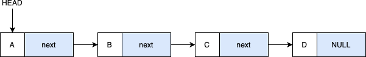
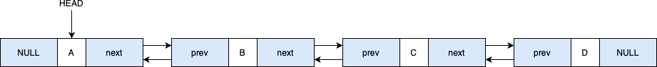

# C - Introduction aux listes chaînées

Les listes chaînées sont une structure de données fondamentale en langage C. Elles permettent de stocker des éléments de manière dynamique et flexible. Ce guide vous aidera à comprendre ce que sont les listes chaînées, la différence entre les listes simplement chaînées et les listes doublement chaînées. Nous nous concentrerons ensuite sur les listes doublement chaînées avec des exemples clairs pour faciliter votre apprentissage.

---

## Qu'est-ce qu'une liste chaînée ?

Une liste chaînée est une collection de nœuds, où chaque nœud contient des données et un pointeur vers le nœud suivant. Cela crée une séquence linéaire de nœuds reliés les uns aux autres.

Imaginez une file de wagons de train transportant des marchandises (les données). Chaque wagon est attaché au suivant, formant une chaîne. Vous pouvez facilement ajouter ou retirer des wagons sans avoir à déplacer toute la chaîne.

---

## Différence entre liste simplement chaînée et liste doublement chaînée

### Liste simplement chaînée

- Structure : chaque nœud contient des données et un pointeur vers le nœud suivant.
- Navigation : se fait dans un seul sens (de la tête vers la fin).
- Utilisation mémoire : moins de mémoire utilisée car il y a un seul pointeur par nœud.

<br>
<p align="center">
    <picture>
        <source media="(prefers-color-scheme: light)" srcset="../assets/images/c/singly_linked_list-light.webp">
        <source media="(prefers-color-scheme: dark)" srcset="../assets/images/c/singly_linked_list-dark.webp">
        
    </picture>
</p>

### Liste doublement chaînée
- Structure : chaque nœud contient des données, un pointeur vers le nœud précédent et un pointeur vers le nœud suivant.
- Navigation : possible dans les deux sens (avant et arrière).
- Utilisation mémoire : utilise plus de mémoire à cause du pointeur supplémentaire.

<br>
<p align="center">
    <picture>
        <source media="(prefers-color-scheme: light)" srcset="../assets/images/c/doubly_linked_list-light.webp">
        <source media="(prefers-color-scheme: dark)" srcset="../assets/images/c/doubly_linked_list-dark.webp">
        
    </picture>
</p>

Dans une liste doublement chaînée, les wagons du train ont des attelages à l'avant et à l'arrière, ce qui permet de se déplacer dans les deux directions le long du train. Les marchandises représentent les données stockées dans chaque nœud.

---

## Pourquoi utiliser des listes doublement chaînées ?

- Navigation bidirectionnelle : vous pouvez parcourir la liste dans les deux sens, ce qui est utile pour certaines opérations.
- Suppression efficace : supprimer un nœud est plus simple car vous avez accès au nœud précédent.
- Flexibilité : permet une allocation dynamique de mémoire, ajoutant ou supprimant des éléments à tout moment.

---

## Structure d'un nœud dans une liste doublement chaînée

En C, une liste doublement chaînée est implémentée en définissant une structure (`struct`) pour le nœud avec deux pointeurs :

```c
typedef struct node_s
{
	char *data;
	struct node_s *prev;
	struct node_s *next;
} node_t;
```

- `data` : contient les données du nœud (ici, une chaîne de caractères).
- `prev` : pointeur vers le nœud précédent.
- `next` : pointeur vers le nœud suivant.

**Remarque :**

- Organisation du code : dans une pratique standard, la définition de la structure et les prototypes des fonctions seraient placés dans un fichier d'en-tête (`.h`), tandis que les implémentations des fonctions seraient dans un fichier source (`.c`).
- Pour faciliter la lecture, dans les exemples qui suivent, nous intégrerons toutes les parties du code dans un seul fichier afin d'en simplifier la présentation et la compréhension.

---

## Création des nœuds

Pour créer les nœuds de la liste, vous devez allouer de la mémoire dynamiquement et initialiser leurs champs :

```c
node_t *create_node(const char *value)
{
	node_t *new_node = malloc(sizeof(node_t));
	if (new_node == NULL)
	{
		perror("Erreur d'allocation de mémoire.");
		exit(EXIT_FAILURE);
	}

	new_node->data = strdup(value);

	if (new_node->data == NULL)
	{
		perror("Erreur d'allocation de mémoire.");
		free(new_node);
		exit(EXIT_FAILURE);
	}

	new_node->prev = NULL;
	new_node->next = NULL;

	return (new_node);
}
```

**Explication :**

- `malloc` alloue de la mémoire pour un nouveau nœud.
- `strdup` alloue de la mémoire et copie la chaîne value dans data.
- `prev` et `next` sont initialisés à `NULL` car le nœud n'est pas encore connecté.

---

## Insertion des nœuds dans la liste

### Insertion en tête

```c
void insert_at_head(node_t **head, const char *value)
{
	node_t *new_node = create_node(value);

	new_node->next = *head;

	if (*head != NULL)
	{
		(*head)->prev = new_node;
	}

	*head = new_node;
}
```

### Insertion en fin

```c
void insert_at_tail(node_t **head, const char *value)
{
	node_t *new_node = create_node(value);

	if (*head == NULL)
	{
		*head = new_node;
		return;
	}

	node_t *temp = *head;

	while (temp->next != NULL)
	{
		temp = temp->next;
	}

	temp->next = new_node;
	new_node->prev = temp;
}
```

**Explication :**

- Insertion en tête :
    - On crée un nouveau nœud avec `create_node`.
    - Le nouveau nœud pointe vers l'ancien premier nœud.
    - Si la liste n'est pas vide, on met à jour le pointeur `prev` de l'ancien premier nœud.
    - Le pointeur `head` est mis à jour pour pointer vers le nouveau nœud.

- Insertion en fin :
    - On crée un nouveau nœud.
    - Si la liste est vide, le nouveau nœud devient le premier nœud.
    - Sinon, on parcourt la liste jusqu'au dernier nœud.
    - On met à jour les pointeurs `next` du dernier nœud et `prev` du nouveau nœud.

---

## Suppression d'un nœud

Pour supprimer un nœud avec une valeur spécifique :

```c
void delete_node(node_t **head, const char *value)
{
	node_t *temp = *head;

	while (temp != NULL && strcmp(temp->data, value) != 0)
	{
		temp = temp->next;
	}

	if (temp == NULL)
	{
		printf("Valeur '%s' non trouvée dans la liste.\n", value);
		return;
	}

	if (temp->prev != NULL)
	{
		temp->prev->next = temp->next;
	}
	else
	{
		*head = temp->next;
	}

	if (temp->next != NULL)
	{
		temp->next->prev = temp->prev;
	}

	free(temp->data);
	free(temp);
}

```

**Explication :**

- On recherche le nœud contenant la chaîne `value` en utilisant `strcmp`.
- On met à jour les pointeurs `next` et `prev` des nœuds adjacents pour le détacher.
- Si le nœud à supprimer est le premier, on met à jour `*head`.
- On libère la mémoire allouée pour `data` et le nœud lui-même.

---

## Afficher la liste

Pour afficher les éléments de la liste :

```c
void display_list(node_t *head)
{
	node_t *current = head;

	while (current != NULL)
	{
		printf("[%s]", current->data);

		if (current->next != NULL)
			printf(" <-> ");

		current = current->next;
	}
	printf("\n");
}
```

## Exemple complet

Voici un programme complet utilisant les fonctions précédentes :

```c
#include <stdio.h>
#include <stdlib.h>
#include <string.h>

typedef struct node_s
{
	char *data;
	struct node_s *prev;
	struct node_s *next;
} node_t;

node_t *create_node(const char *value);
void insert_at_head(node_t **head, const char *value);
void insert_at_tail(node_t **head, const char *value);
void display_list(node_t *head);
void delete_node(node_t **head, const char *value);
void free_list(node_t *head);

int main(void)
{
	node_t *head = NULL;

	/* Création de la liste : A <-> B <-> C <-> D */
	insert_at_tail(&head, "A");
	insert_at_tail(&head, "B");
	insert_at_tail(&head, "C");
	insert_at_tail(&head, "D");

	printf("\nListe initiale :\n");
	display_list(head);

	/* Insertion de "START" au début */
	insert_at_head(&head, "START");

	printf("\nListe après insertion de \"START\" au début :\n");
	display_list(head);

	/* Insertion de "END" à la fin */
	insert_at_tail(&head, "END");

	printf("\nListe après insertion de \"END\" à la fin :\n");
	display_list(head);

	/* Suppression de "END" */
	delete_node(&head, "END");

	printf("\nListe après suppression de \"END\" :\n");
	display_list(head);

    printf("\n");

	/* Libération de la mémoire */
	free_list(head);

	return (0);
}

/* Implémentation des fonctions */

node_t *create_node(const char *value)
{
	node_t *new_node = malloc(sizeof(node_t));

	if (new_node == NULL)
	{
		perror("Erreur d'allocation de mémoire");
		exit(EXIT_FAILURE);
	}

	new_node->data = strdup(value);

	if (new_node->data == NULL)
	{
		perror("Erreur d'allocation de mémoire");
		free(new_node);
		exit(EXIT_FAILURE);
	}

	new_node->prev = NULL;
	new_node->next = NULL;

	return (new_node);
}

void insert_at_head(node_t **head, const char *value)
{
	node_t *new_node = create_node(value);

	new_node->next = *head;

	if (*head != NULL)
	{
		(*head)->prev = new_node;
	}

	*head = new_node;
}

void insert_at_tail(node_t **head, const char *value)
{
	node_t *new_node = create_node(value);

	if (*head == NULL)
	{
		*head = new_node;
		return;
	}
	node_t *temp = *head;

	while (temp->next != NULL)
	{
		temp = temp->next;
	}

	temp->next = new_node;
	new_node->prev = temp;
}

void display_list(node_t *head)
{
	node_t *current = head;

	while (current != NULL)
	{
		printf("[%s]", current->data);

		if (current->next != NULL)
			printf(" <-> ");

		current = current->next;
	}
	printf("\n");
}

void delete_node(node_t **head, const char *value)
{
	node_t *temp = *head;

	while (temp != NULL && strcmp(temp->data, value) != 0)
	{
		temp = temp->next;
	}

	if (temp == NULL)
	{
		printf("Valeur '%s' non trouvée dans la liste.\n", value);
		return;
	}

	if (temp->prev != NULL)
	{
		temp->prev->next = temp->next;
	}
	else
	{
		*head = temp->next;
	}

	if (temp->next != NULL)
	{
		temp->next->prev = temp->prev;
	}

	free(temp->data);
	free(temp);
}

void free_list(node_t *head)
{
	node_t *current = head;
	node_t *next_node;

	while (current != NULL)
	{
		next_node = current->next;
		free(current->data);
		free(current);
		current = next_node;
	}
}
```

**Explication :**

1. Création de la liste initiale :
- On insère "A", "B", "C", "D" à la fin de la liste pour obtenir :

```bash
[A] <-> [B] <-> [C] <-> [D]
```

2. Insertion de "START" au début :
- On insère "START" en tête de la liste avec `insert_at_head`.
<br>
La liste devient :

```bash
[START] <-> [A] <-> [B] <-> [C] <-> [D]
````

3. Insertion de "END" à la fin :
- On insère "END" en fin de liste avec `insert_at_tail` :

```bash
[START] <-> [A] <-> [B] <-> [C] <-> [D] <-> [END]
````

4. Suppression de "END" :
- On supprime le nœud contenant "END" avec `delete_node` :

```bash
[START] <-> [A] <-> [B] <-> [C] <-> [D]
```

> 📌 Pour faciliter votre compréhension et vous aider à visualiser le fonctionnement des listes doublement chaînées, j'ai réalisé une application web interactive : [Doubly Linked List Visualizer](https://fchavonet.github.io/web-doubly_linked_list_visualizer/).

Cette application vous permet de :

- Créer et manipuler des listes doublement chaînées.
- Visualiser la structure de la liste et les liens entre les nœuds.
- Générer le code C correspondant en temps réel.
- Copier le code généré pour le compiler et l'exécuter dans votre terminal.

---

## Conseils pour bien utiliser les listes doublement chaînées

- Gestion de la mémoire : n'oubliez pas de libérer la mémoire allouée dynamiquement avec `free` pour éviter les fuites de mémoire.
- Vérification des allocations : toujours vérifier si `malloc` et `strdup` retournent `NULL`.
- Comprendre les pointeurs : les pointeurs sont essentiels pour manipuler les listes chaînées. Assurez-vous d'être à l'aise avec leur utilisation.

---

## Conclusion

Les listes doublement chaînées sont une structure de données puissante qui offre une grande flexibilité pour gérer des collections de données en C.
En comprenant leur fonctionnement et en pratiquant leur implémentation, vous pourrez :

- Créer des structures de données efficaces.
- Naviguer facilement dans les données dans les deux sens.
- Concevoir des algorithmes plus complexes.

Continuez à pratiquer et à explorer pour maîtriser pleinement cette structure de données essentielle !