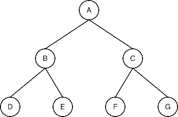
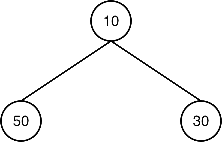
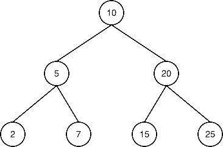
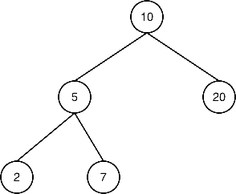

# C - Introduction aux arbres binaires

Les arbres binaires sont une structure de données essentielle, utilisée pour organiser l’information de façon hiérarchique. Comme les listes chaînées, ils utilisent des nœuds reliés entre eux, mais chaque nœud peut avoir jusqu’à deux enfants : un enfant gauche et un enfant droit. Cette structure permet d’accélérer certaines opérations comme la recherche ou le tri, et de représenter les données de manière plus naturelle dans certains cas.

---

## Qu'est-ce qu'un arbre binaire ?

Un arbre binaire est composé de nœuds reliés hiérarchiquement :

- Racine (root) : nœud au sommet de l’arbre.
- Nœuds enfants (left / right) : chaque nœud peut avoir au plus deux enfants.
- Feuilles (leaves) : nœuds qui n’ont aucun enfant.

<br>
<p align="center">
    <picture>
        <source media="(prefers-color-scheme: light)" srcset="../assets/images/c/binary_tree-light.webp">
        <source media="(prefers-color-scheme: dark)" srcset="../assets/images/c/binary_tree-dark.webp">
        
    </picture>
</p>

- (A) est la racine.
- (B) et (C) sont les enfants de (A).
- (D), (E), (F), (G) sont des feuilles.

---

## Terminologie importante

- Profondeur d’un nœud : nombre de niveaux entre la racine et ce nœud.
- Hauteur d’un arbre : profondeur maximale parmi tous les nœuds (distance la plus longue entre la racine et une feuille).
- Taille d’un arbre : nombre total de nœuds dans l’arbre.
- Arbre parfait : tous les niveaux sont entièrement remplis.
- Arbre complet : tous les niveaux sauf le dernier sont remplis, et les nœuds du dernier niveau sont positionnés le plus à gauche possible.

---

## Différence entre arbre binaire simple et arbre binaire de recherche

### Arbre binaire simple

Aucune organisation particulière n’est imposée :

<br>
<p align="center">
    <picture>
        <source media="(prefers-color-scheme: light)" srcset="../assets/images/c/simple_binary_tree-light.webp">
        <source media="(prefers-color-scheme: dark)" srcset="../assets/images/c/simple_binary_tree-dark.webp">
        
    </picture>
</p>

Ici, les enfants ne respectent aucun ordre particulier. Ce n’est pas un arbre binaire de recherche.

### Arbre binaire de recherche (BST:  Binary Search Tree)

Respecte une contrainte d’ordre pour faciliter la recherche :

- Les valeurs dans le sous-arbre gauche sont strictement inférieures à la valeur du nœud courant.
- Celles du sous-arbre droit sont strictement supérieures.

<br>
<p align="center">
    <picture>
        <source media="(prefers-color-scheme: light)" srcset="../assets/images/c/binary_search_tree-light.webp">
        <source media="(prefers-color-scheme: dark)" srcset="../assets/images/c/binary_search_tree-dark.webp">
        
    </picture>
</p>

Un tel arbre permet une recherche rapide en `O(log n)` si l’arbre est équilibré.

---

## Structure d’un nœud d’arbre binaire en C

En C, on peut représenter un nœud d’arbre avec une `struct` :

```c
typedef struct binary_tree_s
{
	int n;
	struct binary_tree_s *parent;
	struct binary_tree_s *left;
	struct binary_tree_s *right;
} binary_tree_t;
```

- `n` : valeur stockée (ici, un entier).
- `parent` : pointeur vers le parent du nœud.
- `left` et `right` : pointeurs vers les enfants gauche et droit.

---

## Création d’un nœud

Pour créer un nœud dans un arbre binaire, on utilise malloc et on initialise ses champs :

```c
binary_tree_t *binary_tree_node(binary_tree_t *parent, int value)
{
	binary_tree_t *new_node = malloc(sizeof(binary_tree_t));

	if (new_node == NULL)
	{
		perror("Erreur d'allocation de mémoire");
		exit(EXIT_FAILURE);
	}

	new_node->n = value;
	new_node->parent = parent;
	new_node->left = NULL;
	new_node->right = NULL;

	return (new_node);
}
```

**Explication :**

- `malloc` alloue la mémoire pour le nouveau nœud.
- `new_node->n` stocke la valeur `value`.
- `parent` permet de relier ce nœud à son parent (ou `NULL` si c’est la racine).
- Les pointeurs `left` et `right` sont mis à `NULL` puisqu’ils ne sont pas encore définis.

---

## Les différents parcours (traversées) d’un arbre binaire

Pour visiter tous les nœuds d’un arbre et traiter leurs valeurs, on utilise les traversées (ou parcours) :

### Parcours pré-ordre (racine → gauche → droite)

```c
void binary_tree_preorder(const binary_tree_t *tree, void (*func)(int))
{
	if (tree == NULL || func == NULL)
		return;

	func(tree->n);
	binary_tree_preorder(tree->left, func);
	binary_tree_preorder(tree->right, func);
}
```

### Parcours en ordre (gauche → racine → droite)

```c
void binary_tree_inorder(const binary_tree_t *tree, void (*func)(int))
{
	if (tree == NULL || func == NULL)
		return;

	binary_tree_inorder(tree->left, func);
	func(tree->n);
	binary_tree_inorder(tree->right, func);
}
```

### Parcours post-ordre (gauche → droite → racine)

```c
void binary_tree_postorder(const binary_tree_t *tree, void (*func)(int))
{
	if (tree == NULL || func == NULL)
		return;

	binary_tree_postorder(tree->left, func);
	binary_tree_postorder(tree->right, func);
	func(tree->n);
}
```

### Parcours en largeur (niveau par niveau, gauche → droite)

```c
void binary_tree_levelorder(const binary_tree_t *tree, void (*func)(int))
{
	if (tree == NULL || func == NULL)
		return;

	queue_t *queue = queue_create();
	if (!queue)
		return;

	enqueue(queue, (binary_tree_t *)tree);

	while (!queue_is_empty(queue))
	{
		binary_tree_t *current = dequeue(queue);
		func(current->n);

		if (current->left)
			enqueue(queue, current->left);
		if (current->right)
			enqueue(queue, current->right);
	}

	queue_free(queue);
}
```

Pour faciliter votre compréhension et vous aider à visualiser le fonctionnement des arbres binaires et de leurs différents parcours, voici une application web interactive : [Binary Tree Visualizer](https://fchavonet.github.io/web-binary_tree_visualizer/).

Cette application vous permet de :

- Créer un arbre binaire simple et le visualiser.
- Observer les différentes manières de le parcourir.

---

## Fonctions supplémentaires

### Taille d’un arbre

Pour connaître le nombre total de nœuds :

```c
size_t binary_tree_size(const binary_tree_t *tree)
{
	if (tree == NULL)
		return (0);

	return (1 + binary_tree_size(tree->left) + binary_tree_size(tree->right));
}
```

### Hauteur d’un arbre

Pour déterminer la profondeur maximale :

```c
size_t binary_tree_height(const binary_tree_t *tree)
{
	size_t left_height;
	size_t right_height;

	if (tree == NULL || (tree->left == NULL && tree->right == NULL))
		return (0);

	left_height = binary_tree_height(tree->left);
	right_height = binary_tree_height(tree->right);

	return (1 + (left_height > right_height ? left_height : right_height));
}
```

### Libération de l'arbre

Pour libérer correctement toute la mémoire allouée par l’arbre, on utilise une fonction récursive qui supprime d’abord les sous-arbres gauche et droit avant de libérer le nœud courant.

```c
void binary_tree_delete(binary_tree_t *tree)
{
	if (tree == NULL)
		return;

	binary_tree_delete(tree->left);
	binary_tree_delete(tree->right);
	free(tree);
}
```

---

## Exemple complet

Ci-dessous, un petit programme complet illustrant la création d’un arbre, son parcours en pré-ordre, et l’utilisation des fonctions binary_tree_size et binary_tree_height.

```c
#include <stdio.h>
#include <stdlib.h>

typedef struct binary_tree_s
{
	int n;
	struct binary_tree_s *parent;
	struct binary_tree_s *left;
	struct binary_tree_s *right;
} binary_tree_t;

binary_tree_t *binary_tree_node(binary_tree_t *parent, int value)
{
	binary_tree_t *new_node = malloc(sizeof(binary_tree_t));

	if (new_node == NULL)
	{
		perror("Échec de l'allocation mémoire");
		exit(EXIT_FAILURE);
	}

	new_node->n = value;
	new_node->parent = parent;
	new_node->left = NULL;
	new_node->right = NULL;

	return (new_node);
}

void binary_tree_preorder(const binary_tree_t *tree, void (*func)(int))
{
	if (tree == NULL || func == NULL)
		return;

	func(tree->n);
	binary_tree_preorder(tree->left, func);
	binary_tree_preorder(tree->right, func);
}

size_t binary_tree_size(const binary_tree_t *tree)
{
	if (tree == NULL)
		return (0);

	return (1 + binary_tree_size(tree->left) +
			binary_tree_size(tree->right));
}

size_t binary_tree_height(const binary_tree_t *tree)
{
	size_t left_height;
	size_t right_height;

	if (tree == NULL || (tree->left == NULL && tree->right == NULL))
		return (0);

	left_height = binary_tree_height(tree->left);
	right_height = binary_tree_height(tree->right);

	return (1 + (left_height > right_height ? left_height : right_height));
}

void binary_tree_delete(binary_tree_t *tree)
{
	if (tree == NULL)
		return;

	binary_tree_delete(tree->left);
	binary_tree_delete(tree->right);
	free(tree);
}

void print_node(int n)
{
	printf("%d ", n);
}

int main(void)
{
	binary_tree_t *root;

	root = binary_tree_node(NULL, 10);
	root->left = binary_tree_node(root, 5);
	root->right = binary_tree_node(root, 20);
	root->left->left = binary_tree_node(root->left, 2);
	root->left->right = binary_tree_node(root->left, 7);

	printf("Parcours pré-ordre : ");
	binary_tree_preorder(root, print_node);
	printf("\n");

	printf("Taille de l'arbre : %lu\n", binary_tree_size(root));
	printf("Hauteur de l'arbre : %lu\n", binary_tree_height(root));

	binary_tree_delete(root);
	return (0);
}
```

**Explication :**

<br>
<p align="center">
    <picture>
        <source media="(prefers-color-scheme: light)" srcset="../assets/images/c/binary_search_tree_example-light.webp">
        <source media="(prefers-color-scheme: dark)" srcset="../assets/images/c/binary_search_tree_example-dark.webp">
        
    </picture>
</p>

- Création de la racine avec la valeur 10.
- Ajout de deux enfants à la racine : 5 à gauche et 20 à droite.
- Ajout de deux nœuds supplémentaires comme enfants de 5 : 2 à gauche et 7 à droite.
- Parcours en pré-ordre de l’arbre pour afficher les valeurs dans l’ordre : racine, gauche, droite.
- Calcul et affichage de la taille de l’arbre (nombre total de nœuds),
- Calcul et affichage de sa hauteur (nombre d’arêtes entre la racine et la feuille la plus profonde).

---

## Applications courantes

- Recherche rapide : un BST (Binary Search Tree) peut offrir une recherche très performante (en `O(log n)` dans le meilleur des cas).
- Tri : le tri par tas (heap sort) repose sur une structure de type arbre binaire (un tas binaire).
- Hiérarchisation de données : représentation de systèmes de fichiers (dossiers et sous-dossiers), bases de données arborescentes, etc.
- Algorithmes : de nombreux algorithmes avancés s’appuient sur des arbres binaires (arbres rouges-noirs, AVL, etc.) pour assurer l’équilibrage automatique des données.

---

## Conseils pour bien utiliser les arbres binaires

- Gestion de la mémoire : n’oubliez jamais de libérer les nœuds alloués lorsque vous avez fini de les utiliser.
- Équilibrage : si un arbre binaire n’est pas équilibré, la performance peut se dégrader (jusqu’à `O(n)` pour certaines opérations). Les arbres auto-équilibrés (AVL, rouges-noirs) sont souvent préférés pour les applications sensibles aux performances.
- Pointeurs : maîtrisez bien la manipulation des pointeurs (enfants et parent) pour éviter les accès invalides.

---

## Conclusion

Les arbres binaires sont une structure de données centrale en programmation :

- Ils facilitent la recherche et l’organisation hiérarchique des données.
- Ils forment la base de nombreuses structures avancées (BST, arbres équilibrés, tas…).
- Ils sont polyvalents et se retrouvent dans de multiples domaines (systèmes de fichiers, bases de données, algorithmes de tri, etc.).

En prenant le temps de comprendre les concepts de nœuds, de traversées et de propriétés (taille, hauteur), vous serez en mesure d’utiliser efficacement les arbres binaires dans vos projets C. N’hésitez pas à expérimenter, créer des fonctions d’insertion, de suppression, et à explorer les différentes formes d’arbres pour enrichir votre maîtrise de cette structure essentielle !