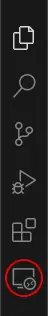
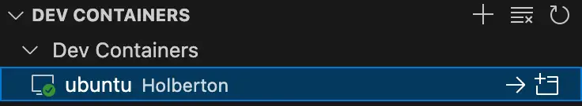
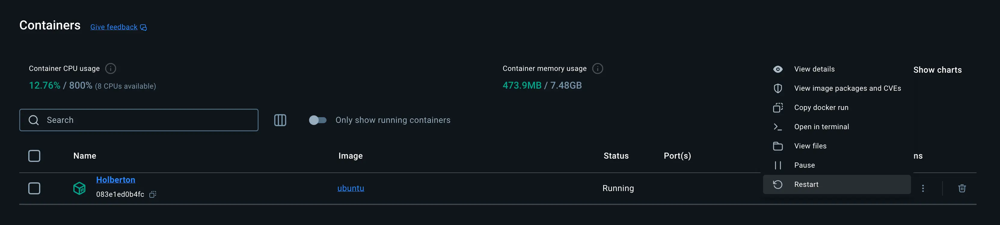

# Mac - Configuration d’une sandbox Ubuntu avec Docker

1. Télécharger et installer [Docker Desktop](https://www.docker.com/products/docker-desktop/) (pas d'obligation de se connecter, peut être utilisé sans compte).

2. Télécharger et installer [Visual Studio Code](https://code.visualstudio.com/download).

3. Installer l'extension [Dev Containers](https://marketplace.visualstudio.com/items?itemName=ms-vscode-remote.remote-containers) dans Visual Studio Code.

4. Ouvrir le Terminal.

5. Créer un répertoire de travail où vous le souhaitez (par exemple : `Documents/Ubuntu`) :

```bash
mkdir -p Documents/Ubuntu
```

6. Naviguer vers le répertoire créé à l'étape précédente :

```bash
cd Documents/Ubuntu
```

7. Télécharger l'image Ubuntu pour Docker :

```bash
docker pull ubuntu:latest
```

8. Créer un nouveau conteneur Ubuntu et l'exécuter en mode interactif :

```bash
docker run -itd --restart always --name Holberton -v "$(pwd):/home/ubuntu/" ubuntu
```

**Explications de la commande :**

- `docker run` : cette commande lance un nouveau conteneur Docker basé sur une image spécifiée (ici, l'image Ubuntu).

- `-itd` : exécute le conteneur en mode interactif (`i`) et alloue un pseudo-terminal (`t`), tout en le lançant en arrière-plan (`d`).

- `--restart always` : configure le conteneur pour qu'il redémarre automatiquement s'il s'arrête. Cela inclut les redémarrages du système hôte. Le conteneur continuera à redémarrer jusqu'à ce qu'il soit explicitement arrêté ou supprimé.

- `--name Holberton` : attribue le nom Holberton au conteneur. Cela facilite la gestion du conteneur, car vous pouvez le référencer par son nom plutôt que par son identifiant généré.

- `$(pwd)` : cette commande shell est remplacée par le répertoire de travail actuel sur le système hôte.

- `-v $(pwd):/home/ubuntu/` : monte le répertoire actuel dans `/home/ubuntu/` dans le conteneur, permettant de synchroniser les fichiers entre le système hôte et le conteneur.

- `ubuntu` : spécifie l'image Docker à utiliser pour créer le conteneur. Ici, il s'agit de l'image officielle d'Ubuntu.

9. Fermer le Terminal.

10. Ouvrir Visual Studio Code et cliquer sur l'icône Remote Explorer.

<p align="left">
    
</p>

11. Cliquer sur `ubuntu Holberton` (dans notre exemple).

12. Cliquer sur la flèche vers la droite (->) pour lancer le conteneur.

<p align="left">
    
</p>

13. Ouvrir le dossier utilisateur en tant que projet dans Visual Studio Code.

14. Ouvrir un Terminal, toujours dans Visual Studio Code (`Cmd+J`).

15. Mettre à jour Ubuntu :

```bash
apt update && apt upgrade -y
```

16. Installer les paquets de base d'Ubuntu (peut ne pas fonctionner selon la version, passer à l'étape 17 si c'est le cas) :

```bash
unminimize
```

17. Installer le paquet *locales* :

```bash
apt install locales -y
```

18. Générer les *locales* :

```bash
locale-gen en_US.UTF-8
```

19. Fermer Visual Studio Code, ouvrir Docker Desktop et redémarrer le conteneur Holberton.

<p align="left">
    
</p>

20. Relancer Visual Studio Code.

21. Configurer les *locales* :

```bash
export LANG=en_US.UTF-8
export LANGUAGE=en_US:en
export LC_ALL=en_US.UTF-8
```

22. Installer `git` :

```bash
apt install git -y
```

23. Configurer `git` :

```bash
git config --global user.name "Nom d'utilisateur GitHub"
```

```bash
git config --global user.email "Email GitHub"
```

> Il est important d'utiliser votre vrai pseudonyme GitHub et l'adresse mail exacte de votre compte.

24. Installer `vim` :

```bash
apt install vim -y
```

---

À cette étape, l'environnement de développement est configuré avec le minimum vital pour débuter la formation Holberton.

Il est important de se rappeler de démarrer Docker Desktop avant d'ouvrir Visual Studio Code.

Un avantage significatif de cette méthode est que votre répertoire `Documents/Ubuntu` (dans notre exemple) est accessible à la fois depuis Visual Studio Code et le Finder du Mac.

Vous n'aurez pas besoin d'utiliser `sudo` avant les commandes, car vous êtes directement administrateur.

Vous pouvez maintenant suivre les instructions des projets sans aucun problème avec une sandbox Ubuntu configurée localement.

---

## Bonus :

25. Installer `gcc` :

```bash
apt install gcc -y
```

26. Installer `make` :

```bash
apt install make -y
```

27. Installer `python3` :

```bash
apt install python3 -y
```

28. Installer `pycodestyle` :

```bash
apt install pycodestyle -y
```

29. Installer `pip` :

```bash
apt install python3-pip -y
```

30. Installer `venv` :

```bash
apt install python3-venv -y
```

31. Installer `curl` :

```bash
apt-get install curl 
```

> Si vous souhaitez en savoir plus sur les environnements virtuels en Python, référez-vous à cette page de concept : [Création d’un environnement virtuel avec `venv`](https://github.com/fchavonet/holbertonschool-concepts/blob/main/python/python-000-creation_d_un_environnement_virtuel_avec_venv.md).

32. Installer `npm` (Node Package Manager) :

```bash
apt install npm -y
```

33. Installer `Node.js` :

```bash
apt install nodejs
```