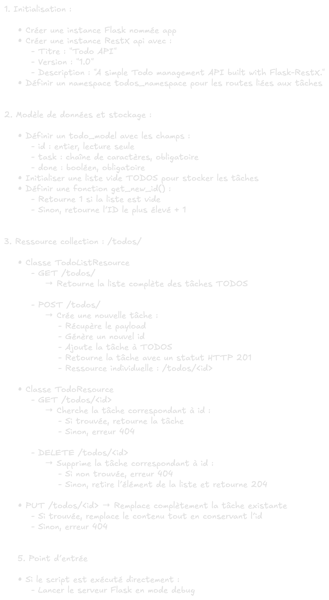

# Le pseudocode ?

## Introduction

Avant d’écrire une seule ligne de code, il est fondamental de penser comme un développeur.
<br>
Cela signifie : comprendre la logique du programme, identifier les étapes nécessaires, structurer le traitement des données.
<br>
Le pseudocode est un outil précieux pour cela. Il permet de formaliser une solution algorithmique sans se soucier de la syntaxe d’un langage particulier.

## Qu’est-ce que le pseudocode ?

Le pseudocode (ou pseudo-code) est une représentation textuelle et simplifiée d’un algorithme. Il se situe entre le langage naturel et le langage de programmation.
Il n’a pas de grammaire universelle stricte : l’objectif est la clarté et la compréhension.

> 📌 But : exprimer clairement la logique d’un programme, étape par étape, sans syntaxe technique.

## Pourquoi utiliser du pseudocode ?

- Écrire le déroulement du programme avant d’être contraint par la syntaxe.
- Permet à toute l’équipe (technique ou non) de comprendre la logique métier.
- Mieux anticiper les cas d’erreur, les conditions limites, les boucles infinies, etc...
- Sert de brouillon structuré avant la traduction en code.
- Permet de confronter l’intention de départ avec l’implémentation réelle.

> 📌 Logique métier : ensemble des règles et traitements qui traduisent les besoins réels d’un utilisateur ou d’un domaine dans une application.

## Caractéristiques du pseudocode

- Langage naturel : généralement rédigé en français ou en anglais, sans symboles techniques.
- Structure logique : instructions en séquence, conditions (SI… ALORS…), boucles (POUR…, TANT QUE…).
- Doit être lisible par n’importe qui, même sans connaissance approfondie du langage cible.
- Applicable à n’importe quel langage de programmation.

## Cas concret : API de gestion de tâches (Todo)

Nous allons concevoir une API RESTful minimaliste pour gérer une liste de tâches avec stockage en mémoire.

### Fonctionnalités attendues

- Ajouter, lire, modifier, supprimer des tâches.
- Génération automatique de la documentation Swagger.
- Aucune base de données, uniquement une liste en mémoire.

### Structure des données

```json
{
  "id": 1,
  "task": "Acheter du pain",
  "done": false
}
```

### Pseudocode

<p align="left">
    <picture>
        <source media="(prefers-color-scheme: dark)" srcset="../assets/images/notion/pseudocode-toto-light.webp">
        <source media="(prefers-color-scheme: light)" srcset="../assets/images/notion/pseudocode-toto-dark.webp">
        
    </picture>
</p>

## Le code créé à partir de ce travail

```python
from flask import Flask
from flask_restx import Api, Resource, fields

app = Flask(__name__)

api = Api(
    app,
    title="TODO API",
    version="1.0",
    description="A simple Todo management API built with Flask-RESTX...",
)

todos_namespace = api.namespace("todos", description="Operations related to Todo items.")

# ------------------------------ #
# Data model & in-memory storage #
# ------------------------------ #

todo_model = api.model(
    "Todo",
    {
        "id": fields.Integer(readonly=True, description="Unique identifier"),
        "task": fields.String(required=True, description="Task description"),
        "done": fields.Boolean(required=True, description="Completion status"),
    },
)

TODOS: list[dict] = []


def get_new_id() -> int:
    """
    Compute the next available ID (simple auto-increment).
    """

    if not TODOS:
        return 1
    return max(todo["id"] for todo in TODOS) + 1


# ------------------- #
# Collection resource #
# ------------------- #


@todos_namespace.route("/")
class TodoListResource(Resource):
    """
    List all Todos or create a new one.
    """

    @todos_namespace.marshal_list_with(todo_model)
    def get(self):
        """
        Return the full list of tasks.
        """

        return TODOS

    @todos_namespace.expect(todo_model, validate=True)
    @todos_namespace.marshal_with(todo_model, code=201)
    def post(self):
        """
        Create a new task.
        """

        data = api.payload
        data["id"] = get_new_id()
        TODOS.append(data)
        return data, 201


# ------------- #
# Item resource #
# ------------- #


@todos_namespace.route("/<int:id>")
@todos_namespace.response(404, "Todo not found")
@todos_namespace.param("id", "The task identifier")
class TodoResource(Resource):
    """
    Retrieve, update, or delete a single task.
    """

    @todos_namespace.marshal_with(todo_model)
    def get(self, id: int):
        """
        Fetch one task.
        """

        for todo in TODOS:
            if todo["id"] == id:
                return todo
        api.abort(404, f"Todo {id} doesn't exist...")

    @todos_namespace.response(204, "Todo deleted!")
    def delete(self, id: int):
        """
        Delete a task.
        """

        global TODOS
        remaining_todos: list[dict] = []
        found = False

        for todo in TODOS:
            if todo["id"] != id:
                remaining_todos.append(todo)
            else:
                found = True

        if not found:
            api.abort(404, f"Todo {id} doesn't exist...")

        TODOS = remaining_todos

        return "", 204

    @todos_namespace.expect(todo_model, validate=True)
    @todos_namespace.marshal_with(todo_model)
    def put(self, id: int):
        """
        Replace an existing task entirely.
        """

        for index, todo in enumerate(TODOS):
            if todo["id"] == id:
                updated_task = api.payload
                updated_task["id"] = id
                TODOS[index] = updated_task

                return updated_task

        api.abort(404, f"Todo {id} doesn't exist...")


# ----------- #
# Entry point #
# ----------- #


if __name__ == "__main__":
    app.run(debug=True, port="3000")
```

## Tester l'API

1. Dans un dossier dédié, Créer le fichier `todo_api.py` et y copier le code ci-dessus.

2. Installer les dépendances :

```bash
python -m venv venv
source venv/bin/activate
pip install flask flask-restx
```

3. Lancer le serveur :

```bash
python todo_api.py
```

- Documentation Swagger : [http://127.0.0.1:3000/](http://127.0.0.1:3000/)
- JSON (data) : [http://127.0.0.1:3000/todos/](http://127.0.0.1:3000/todos/)

4. Endpoints disponibles :

| **Méthode** | **URL**     | **Description**                  |
| :---------: | :---------: | -------------------------------- |
| GET         | `/todos/`   | Liste toutes les tâches.         |
| POST        | `/todos/`   | Crée une nouvelle tâche.         |
| GET         | `/todos/id` | Récupère une tâche spécifique.   |
| PUT         | `/todos/id` | Remplace complètement une tâche. |
| DELETE      | `/todos/id` | Supprime une tâche.              |

5. Exemple de requête POST :

```bash
curl -X POST http://localhost:3000/todos/ \
-H 'Content-Type: application/json' \
-d '{"task": "Réviser Flask", "done": false}'
```