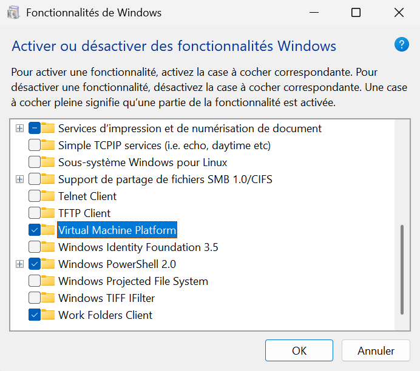
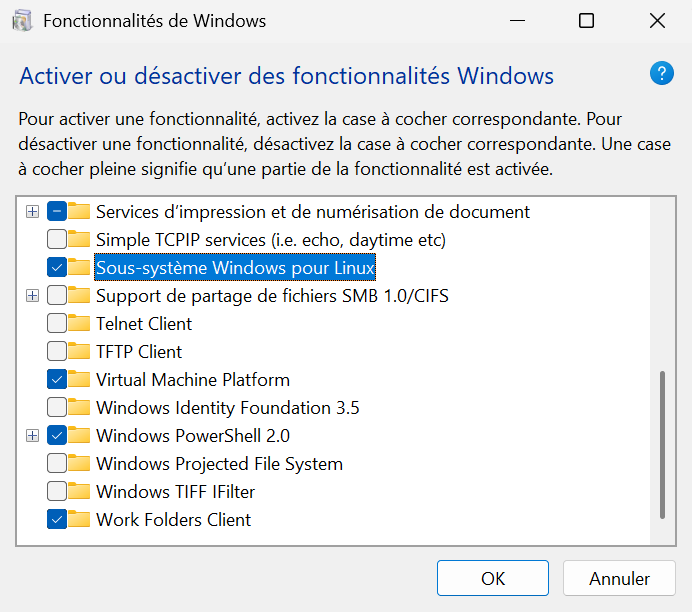
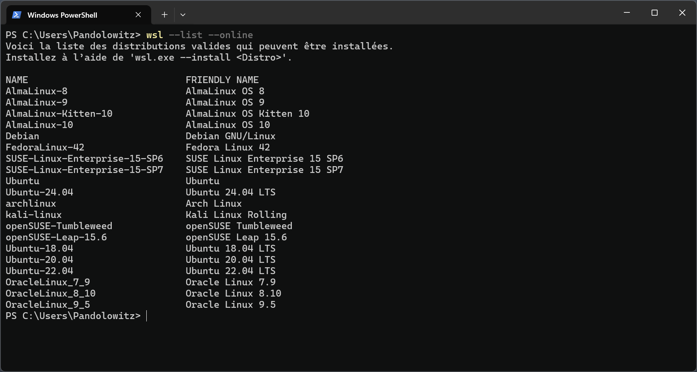
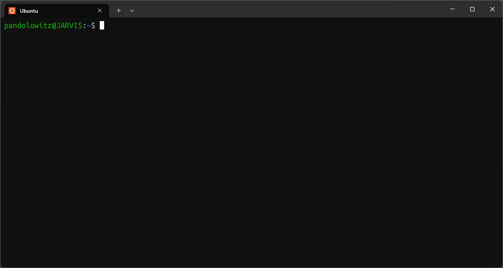
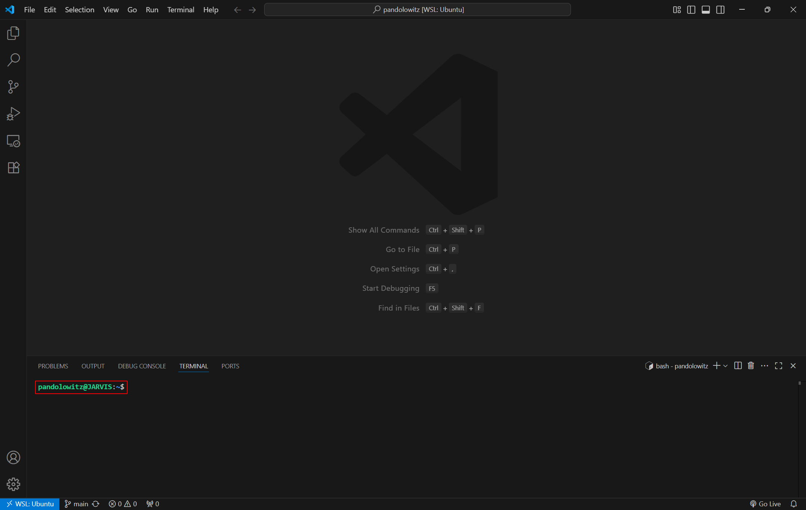
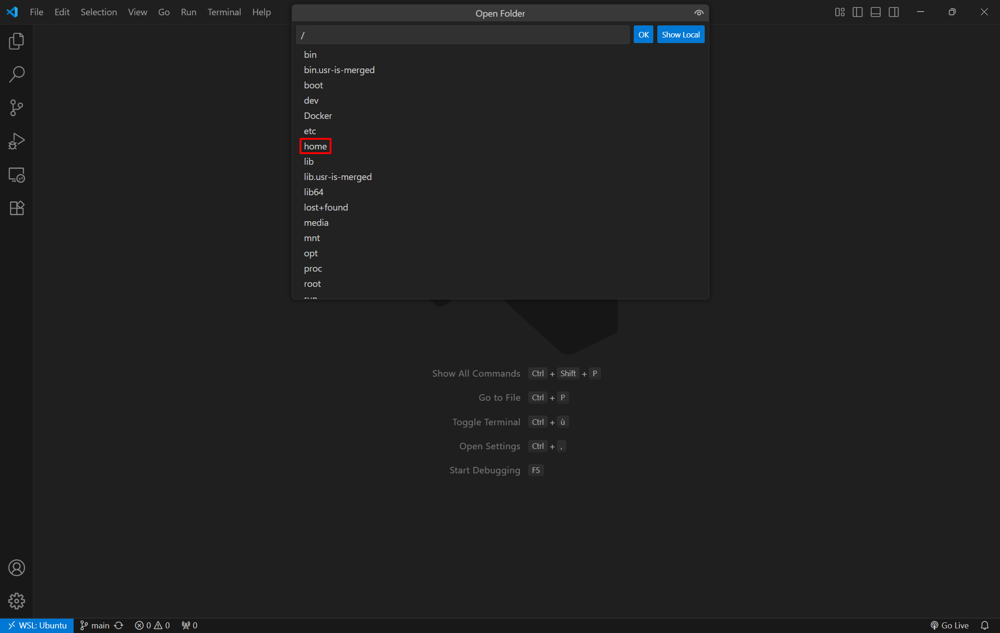

# Windows - Configuration d'une sandbox Ubuntu avec WSL

1. Télécharger et installer [Visual Studio Code](https://code.visualstudio.com/download).

2. Installer l'extension [WSL](https://marketplace.visualstudio.com/items?itemName=ms-vscode-remote.remote-wsl) dans Visual Studio Code.

3. Fermer Visual Studio Code.

4. Ouvrir le Terminal en mode administrateur (clic droit sur le logo Windows dans la barre des tâches, puis cliquer sur `Terminal (administrateur)`).

5. Installer WSL (Windows Subsystem for Linux) :

```powershell
wsl --install
```

> Vous pouvez aussi passer par le Microsoft Store mais utiliser la commande Terminal à l'avantage d'activer certaines options automatiquement.

6. S'assurer que `Virtual Machine Platform` et `Sous-système Windows pour Linux` sont bien activés dans les fonctionnalités de Windows.

<table>
    <tr valign="top">
        <td align="center">
            
        </td>
        <td align="center">
            
        </td>
    </tr>
</table>

> Pour trouver ces réglages, aller dans Paramètres/Système/Fonctionnalités facultatives/Plus de fonctionnalités Windows

7. Redemarrer l'ordinateur si demandé.

8. Ouvrir de nouveau le Terminal en mode administrateur.

9. Lister les distributions Linux installable :

```powershell
wsl --list --online
```



10. Installer la version de Linux qui vous convient (Ubuntu dans notre exemple) :

```powershell
wsl --install -d Ubuntu
```

11. Une fois l'installation finie, choisissez un pseudonyme (sans majuscule) et un mot de passe.

> Il est normal que rien ne s'affiche lorsque vous tappez votre mot de passe.

12. Vous serez normalement sur un Terminal Ubuntu (visible grace au changement de prompt).



13. Relier WSL et Visual Studio Code en tappant :

```powershell
code .
```

14. Normalement une installation se déclenche sur le Terminal et Visual Studio Code devrait se lancer automatiquement et être relié à WSL (si l'extension [WSL](https://marketplace.visualstudio.com/items?itemName=ms-vscode-remote.remote-wsl) a été correctement installée).

15. Ouvrir un Terminal dans Visual Studio Code (`Ctrl+J`) pour vérifier que vous êtes bien sous Ubuntu.



15. Cliquer sur File/Open Folder et naviger jusqu'au dossier utilisateur de votre Ubuntu.



16. Masquer les fichiers normalement cachés sous Linux :

    - Cliquer sur Manage (⚙️)/Settings.
    - Cliquer sur l'onglet Workspace.
    - Descendre jusqu'à "Files: Exclude".
    - Ajouter les éléments à masquer en cliquant sur "Add Pattern" ().
    - Entrer `**/.vscode` pour masquer le fichier `.vscode`.
    - Répéter l'opération pour chacun des fichiers que vous ne voulez pas voir dans votre dossier utilisateur.

> Il est possible de masquer directement tous les fichiers cachés de Linux en ajoutant : `*.*` mais avec le risque de masquer des fichiers utiles, par exemple après l'installation de Git, un fichier `.gitconfig` sera présent, il est conseillé de le garder car pratique pour changer la configuration de Git sans utiliser de ligne de commande.

17. Mettre à jour Ubuntu :

```bash
sudo apt update && apt upgrade -y
```

18. Installer `git` :

```bash
sudo apt install git -y
```

19. Configurer `git` :

```bash
git config --global user.name "Nom d'utilisateur GitHub"
```

```bash
git config --global user.email "Email GitHub"
```

> Il est important d'utiliser votre vrai pseudonyme GitHub et l'adresse mail exacte de votre compte.

---

À cette étape, l'environnement de développement est configuré avec le minimum vital pour débuter la formation Holberton.

Si jamais votre WSL n'était plus lié à Visual Studio Code, il vous suffira de retapper la commande `code .` dans le Terminal Ubuntu de Windows.

Vous pouver naviguer dans votre distribution Linux directement depuis l'Explorateur de fichier Windows, celà peut être pratique pour transférer des fichiers.

Vous pouvez maintenant suivre les instructions des projets sans aucun problème avec une sandbox Ubuntu configurée localement.

---

## Bonus :

20. Installer `gcc` :

```bash
sudo apt install gcc -y
```

21. Installer `make` :

```bash
sudo apt install make -y
```

22. Installer `pycodestyle` :

```bash
sudo apt install pycodestyle -y
```

23. Installer `pip` :

```bash
sudo apt install python3-pip -y
```

24. Installer `venv` :

```bash
sudo apt install python3-venv -y
```

> Si vous souhaitez en savoir plus sur les environnements virtuels en Python, référez-vous à cette page de concept : [Création d’un environnement virtuel avec `venv`](https://github.com/fchavonet/holbertonschool-concepts/blob/main/python/python-000-creation_d_un_environnement_virtuel_avec_venv.md).

25. Installer `npm` (Node Package Manager) :

```bash
apt install npm -y
```

26. Installer `Node.js` :

```bash
apt install nodejs
```