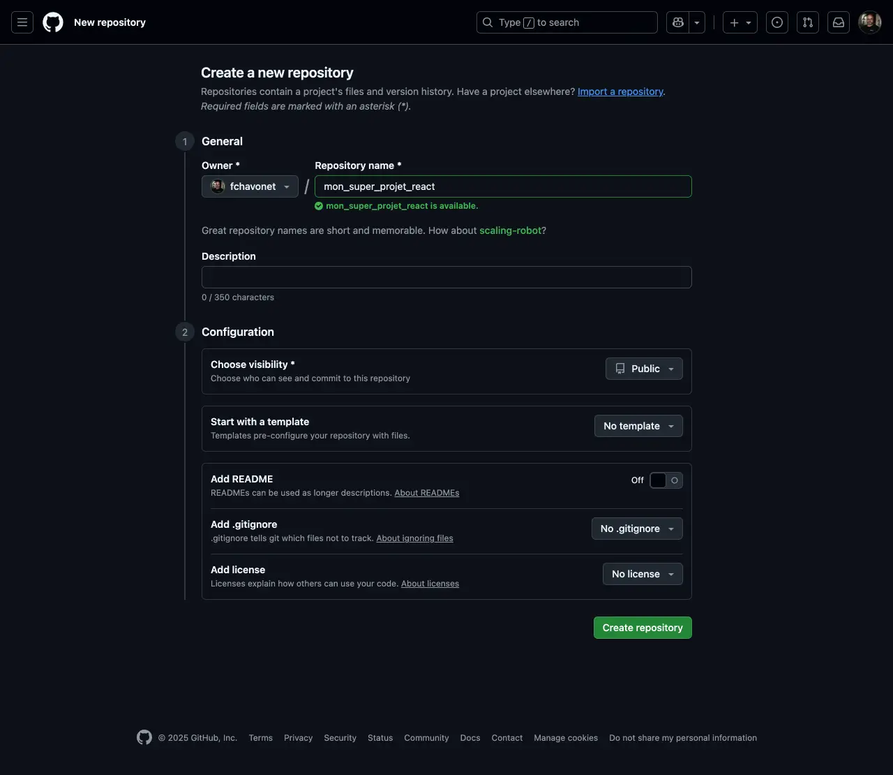
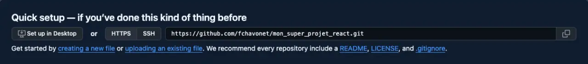
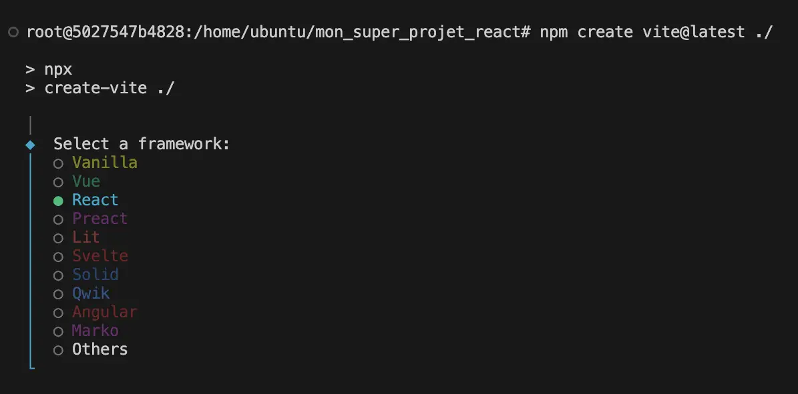
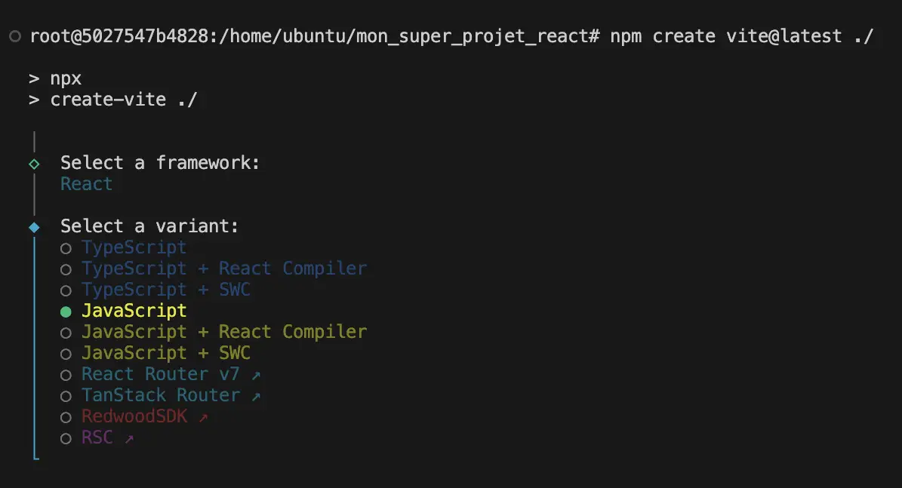
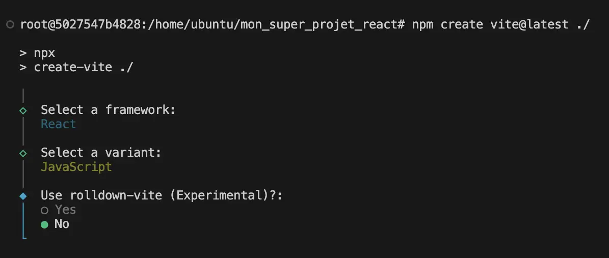
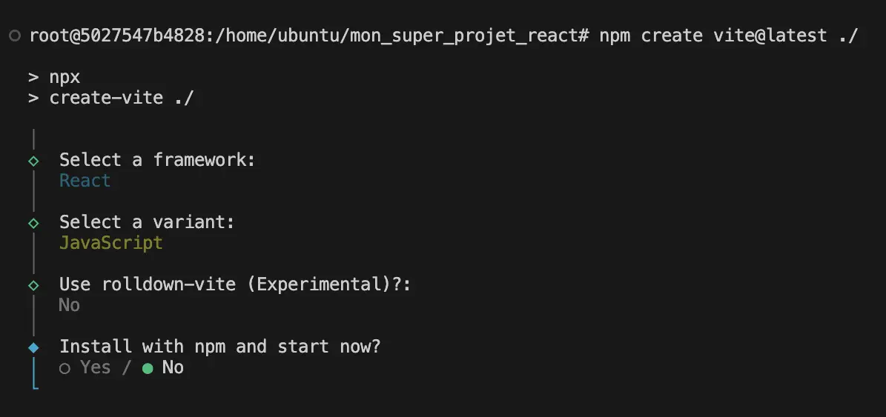
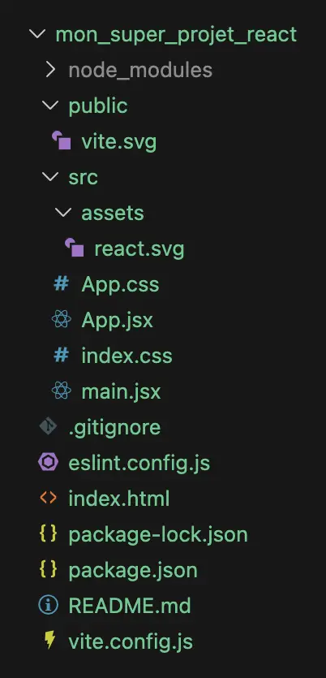
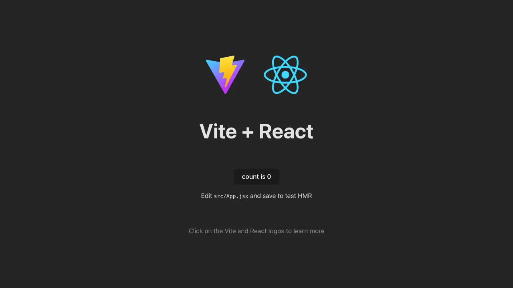

# Monter un projet React proprement et rapidement

L’objectif de ce guide est de créer une base de projet moderne, propre et prête pour le développement.

Nous allons configurer un environnement React/JavaScript utilisant Vite, Tailwind CSS, Lucide React et DaisyUI, avec une configuration minimale d’ESLint.

Cette structure vous permettra de démarrer vos futurs projets dans de bonnes conditions.

---

## Consulter la documentation officielle

Voici les pages de référence des bibliothèques utilisées dans ce concept :

- [Vite/React/Tailwind CSS](https://tailwindcss.com/docs/installation/using-vite) → Framework et style.
- [DaisyUI](https://daisyui.com/docs/install/) → Composants.
- [Lucide React](https://lucide.dev/guide/packages/lucide-react) → Icônes modernes.

---

## Vérifier les prérequis

Pour travailler avec React, il est indispensable de maîtriser les bases du développement web : HTML, CSS et JavaScript.

Vous devez également disposer d’un environnement de développement fonctionnel (Visual Studio Code, Git, Node.js, npm…).

Pour vous aider à configurer cet environnement de travail, vous pouvez consulter l'un de ces guides selon votre système d'exploitation :

- [Configuration d’une sandbox Ubuntu avec Docker](./miscellaneous/mac-001-configuration_d_une_sandbox_ubuntu_avec_docker.md)
- [Configuration d'une sandbox Ubuntu avec WSL](./miscellaneous/windows-001-configuration_d_une_sandbox_ubuntu_avec_wsl.md)

---

## Créer le dépôt GitHub

1. Créer un dépôt vide via GitHub :

Repositories → New → Repository name → Create repository



2. Copier l’URL du dépôt et utiliser votre token GitHub pour vous authentifier.



3. Cloner le dépôt en local :

```
git clone https://{token}@github.com/{votre_pseudo_github}/mon_super_projet_react.git
```

> Si vous ne savez pas ce qu'est un token sur GitHub, merci de vous référer à la [documentation officielle](https://docs.github.com/en/authentication/keeping-your-account-and-data-secure/managing-your-personal-access-tokens).

4. Accéder au dossier cloné (dans notre exemple : `mon_super_projet_react`) :

```
cd mon_super_projet_react
```

---

## Créer le projet Vite

1. Initialiser le projet :

```
npm create vite@latest ./
```

2. Effectuer les réglages suivants :

- Framework : React

- Variant : JavaScript

- Use rolldown-vite : No

- Install with npm and start now? : No


3. Installer les dépendances :

```
npm install
```

Vous devriez avoir cette arborescence dans votre dossier de travail :



---

## Configurer ESLint

1. Ajouter dans `eslint.config.js` :

```
"quotes": ["error", "double"],
"semi": ["error", "always"],
```

> À ajouter juste après : `"no-unused-vars": ["error", { varsIgnorePattern: "^[A-Z_]" }],`

- La première règle force l’usage des guillemets doubles (`"`) (je suis un bon français 😂) !
- La seconde impose les points-virgules (`;`) en fin de ligne.

2. Modifier la section `"scripts"` du fichier `package.json` :

```
 "scripts": {
    "dev": "vite",
    "lint": "eslint .",
    "fix": "eslint . --fix",
    "build": "vite build",
    "preview": "vite preview"
  },
```

Cette zone permet de générer une commande pour lancer un script, en l’occurrence :

| **Script**                  | **Commande**      | **Description**                       |
|-----------------------------|-------------------|---------------------------------------|
| `"dev": "vite"`             | `npm run dev`     | Lancer le serveur de développement.   |
| `"lint": "eslint ."`        | `npm run lint`    | Analyser le code.                     |
| `"fix": "eslint . --fix"`   | `npm run fix`     | Corriger automatiquement les erreurs. |
| `"build": "vite build"`     | `npm run build`   | Construire le projet.                 |
| `"preview": "vite preview"` | `npm run preview` | Tester le build final.                |


3. Lancer la correction automatique :

```
npm run fix
```

> Normalement tous les `'` devraient avoir été remplacés par des `"` et s'il manquait des `;` en fin de ligne, ils devraient avoir été ajoutés.

## Installer et configurer Tailwind CSS

1. Installer Tailwind CSS :

```
npm install tailwindcss @tailwindcss/vite
```

2. Configurer Vite (nous allons aussi en profiter pour personnaliser le serveur de notre application web, étape indispensable si vous travaillez sur Mac).

- Copier le code ci-dessous dans le fichier `vite.config.js` :

```
import { defineConfig } from "vite"
import react from "@vitejs/plugin-react"
import tailwindcss from "@tailwindcss/vite"

// https://vite.dev/config/
export default defineConfig({
  plugins: [
    react(),
    tailwindcss()
  ],
  server: {
    host: "0.0.0.0",
    port: 3000
  }
})
```

3. Tester l’installation :

```
npm run dev
```

Vous devriez avoir un écran similaire à celui de la capture ci-dessous :



Vous pouvez clôturer votre serveur en appuyant sur `Ctrl` + `q` depuis le Terminal.

4. Configurer Tailwind CSS en remplaçant tout le contenu du fichier `src/index.css` par  :

```
@import "tailwindcss";
```

## Nettoyer le projet

- Supprimer les fichiers :
  - `public/vite.svg`
  - `src/assets/react.svg`
  - `src/app.css`
- Renommer le fichier `index.css` en `global.css`.
- Remplacer le contenu du fichier `main.jsx` par cette base de code :

```
import { StrictMode } from "react";
import { createRoot } from "react-dom/client";

import App from "./App.jsx";

import "./global.css";

createRoot(document.getElementById("root")).render(
  <StrictMode>
    <App />
  </StrictMode>,
);
```

- Nettoyer le fichier `App.jsx` en y remplaçant le code existant par celui-ci :

```
function App() {
  return (
    <>
     <h1 className="text-4xl text-red-500">Mon super projet React !!!</h1>
    </>
  );
}

export default App;
```

- Lancez la commande `npm run fix` pour vous assurer que votre code minimal est propre.

Si vous n'avez pas coupé votre serveur, vous devriez avoir une page qui ressemble à la capture ci-dessous (si vous l'avez coupé, le relancer avec `npm run dev`) :


Votre projet est maintenant minimaliste, propre et parfaitement fonctionnel.

Je suis bien conscient que d'autres réglages peuvent être ajoutés (notamment pour ESLint) mais l'idée ici est d'avoir un projet de base sans trop de complexité.

## Installer Lucide React

1. Installer le package :

```
npm install lucide-react
```

2. Tester le package en ajoutant une icône à notre page principale :

- Dans `App.jsx`, ajouter l'import suivant avant la fonction, au tout début du fichier :

```
import { Camera } from "lucide-react";
```

- Ajouter la ligne suivante sous la balise `h1` existante :

```
<Camera color="red" size={48} />
```

Vous devriez avoir le rendu de la capture ci-dessous :


## Installer DaisyUI

1. Installer le package :

```
npm install daisyui@latest --save-dev
```

2. Ajouter la ligne suivante dans le fichier `global.css` :

```
@plugin "daisyui";
```

3. Vérifier l’installation via l'ajout d'un composant DaisyUI :

- Ajouter le code suivant dans le fichier `App.jsx`, juste sous l'icône de camera :

```
<label className="swap swap-rotate">
  {/* this hidden checkbox controls the state */}
  <input className="theme-controller" type="checkbox" value="synthwave" />

  {/* sun icon */}
  <svg
    className="swap-off h-10 w-10 fill-current"
    xmlns="http://www.w3.org/2000/svg"
    viewBox="0 0 24 24">
    <path
      d="M5.64,17l-.71.71a1,1,0,0,0,0,1.41,1,1,0,0,0,1.41,0l.71-.71A1,1,0,0,0,5.64,17ZM5,12a1,1,0,0,0-1-1H3a1,1,0,0,0,0,2H4A1,1,0,0,0,5,12Zm7-7a1,1,0,0,0,1-1V3a1,1,0,0,0-2,0V4A1,1,0,0,0,12,5ZM5.64,7.05a1,1,0,0,0,.7.29,1,1,0,0,0,.71-.29,1,1,0,0,0,0-1.41l-.71-.71A1,1,0,0,0,4.93,6.34Zm12,.29a1,1,0,0,0,.7-.29l.71-.71a1,1,0,1,0-1.41-1.41L17,5.64a1,1,0,0,0,0,1.41A1,1,0,0,0,17.66,7.34ZM21,11H20a1,1,0,0,0,0,2h1a1,1,0,0,0,0-2Zm-9,8a1,1,0,0,0-1,1v1a1,1,0,0,0,2,0V20A1,1,0,0,0,12,19ZM18.36,17A1,1,0,0,0,17,18.36l.71.71a1,1,0,0,0,1.41,0,1,1,0,0,0,0-1.41ZM12,6.5A5.5,5.5,0,1,0,17.5,12,5.51,5.51,0,0,0,12,6.5Zm0,9A3.5,3.5,0,1,1,15.5,12,3.5,3.5,0,0,1,12,15.5Z" />
  </svg>

  {/* moon icon */}
  <svg
    className="swap-on h-10 w-10 fill-current"
    xmlns="http://www.w3.org/2000/svg"
    viewBox="0 0 24 24">
    <path
      d="M21.64,13a1,1,0,0,0-1.05-.14,8.05,8.05,0,0,1-3.37.73A8.15,8.15,0,0,1,9.08,5.49a8.59,8.59,0,0,1,.25-2A1,1,0,0,0,8,2.36,10.14,10.14,0,1,0,22,14.05,1,1,0,0,0,21.64,13Zm-9.5,6.69A8.14,8.14,0,0,1,7.08,5.22v.27A10.15,10.15,0,0,0,17.22,15.63a9.79,9.79,0,0,0,2.1-.22A8.11,8.11,0,0,1,12.14,19.73Z" />
  </svg>
</label>
```

- Nous allons en profiter pour remplacer les svg actuels par des icônes Lucide React ce qui rendra le travail avec des icônes beaucoup plus lisible et rapide !

- On ajoute `Moon` et `Sun` à l'import dans le fichier `App.jsx` des icônes Lucide React :

```
import { Camera, Moon, Sun } from "lucide-react";
```

- Supprimer les blocs `<svg> ... </svg>` et les remplacer par le code suivant :

```
{/* Sun icon */}
<Sun className="swap-on text-red-500" />
```

```
{/* Moon icon */}
<Moon className="swap-off text-red-500" />
```

Vous devriez avoir le rendu ci-dessous :


## Faire fonctionner le bouton de changement de mode

1. Modifier l'import de DaisyUI dans le fichier `global.css` :

```
@plugin "daisyui" {
   themes: light --default, dark;
 }
```

2. Dans le fichier `App.jsx`, modifier l'élément `value` de l'élément `input` du composant DaisyUI :

```
value="dark"
```

> Le changement de mode light/dark devrait fonctionner, attention, il reste très léger et n'est pas persistant, il ne sert ici qu'à illustrer l'import et la modification d'un composant DaisyUI (et sa simplicité d'utilisation/personnalisation).

## Conclusion

Votre environnement React est désormais correctement configuré avec :

- Vite, rapide et moderne !
- Tailwind CSS pour le style.
- Lucide React pour des icônes modernes.
- DaisyUI pour les composants préconstruits.
- Une configuration ESLint minimale efficace.

Vous disposez désormais d’une base de travail propre, professionnelle et facile à réutiliser pour vos futurs projets.

Pour ceux qui le souhaitent, j'ai réalisé un projet lors d'un Live Coding dans le cadre de mon travail comme responsable pédagogique à la Holberton School, il reprend en vidéo les grandes lignes de cette page concept, retrouvez plus d'informations directement sur ce [repository](https://github.com/fchavonet/live_coding-react_and_daisy) !